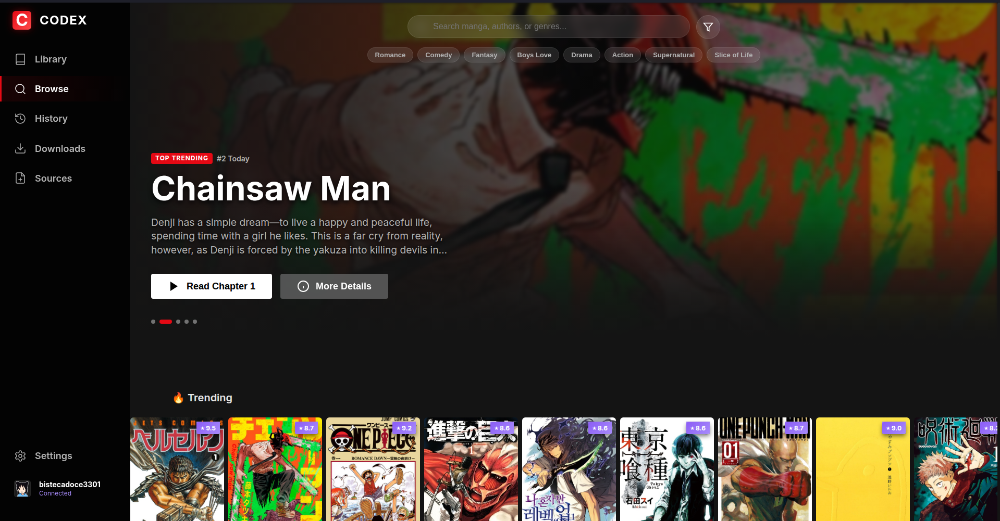
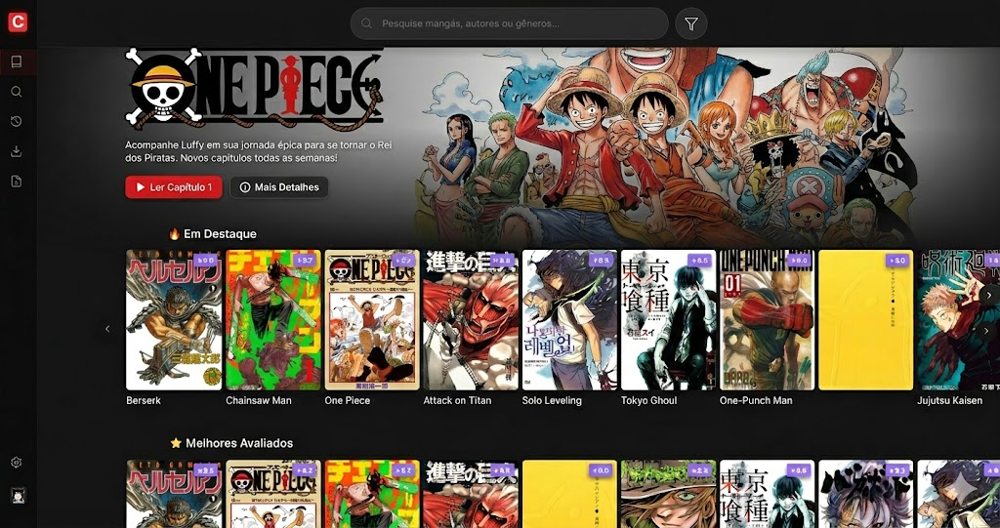
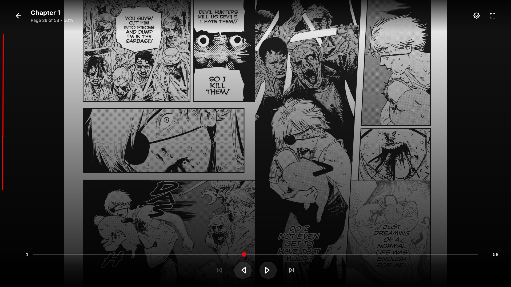

<div align="center">
  
  <h1>📖 CODEX</h1>
  <p><strong>A Premium, Cinematic Desktop Manga Reader</strong></p>
  <p>Inspired by Netflix's UI, built with Electron, React, and a powerful Declarative Source Protocol.</p>
  
  <p>
    
    
    
    
  </p>
</div>

## 📸 The CODEX Experience

### The Discover Page
Netflix-style Discover tab. It features a dynamic Hero Billboard panel that highlights trending titles. Browse a continuously updated list of genres and popular series.

<div align="center">
  
</div>

---

### Immersive Reading Mode
Experience your manga without distractions. The dedicated Reader View eliminates clutter, allowing you to dive into the story with support for vertical scrolling or traditional paged reading.

<div align="center">
  
</div>

---

### Reader Settings
A simple and powerful settings menu. Instantly adjust the Reading Mode (Single, Double, or Webtoon), configure your preferred reading direction (Left to Right or Right to Left), and control the zoom level to perfectly fit your screen.

<div align="center">
  
</div>

---

## ✨ Core Features

- 🍿 **Cinematic UI:** A sleek, fully dark-themed interface modeled after the best streaming platforms. Experience features like a Hero Billboard, dynamic blurring, and buttery-smooth transitions.
- 📚 **Extensible Source Protocol:** Manga content isn't hardcoded. Write tiny JavaScript plugins (`.js` files) to scrape and parse *any* manga website in the world and read it beautifully in the app.
- 🔄 **AniList Integration:** Real-time syncing with your AniList account. Update your scores, see what's trending globally, and automatically mark chapters as read.
- 💾 **Offline Downloads:** Download your favorite chapters into an `.cbz` format and read them without an internet connection using local processing.
- 📖 **Immersive Reading Modes:** Choose between Single Page, Double Page, or endless Webtoon vertical scrolling. Everything is easily accessible via the in-reader HUD.

---

## 🚀 Getting Started

### Prerequisites
Make sure you have [Node.js](https://nodejs.org/) (v18+) and npm installed.

### Installation

1. **Clone the repository**
   ```bash
   git clone https://github.com/your-username/codex.git
   cd codex/codex-app
   ```
2. **Install dependencies**
   ```bash
   npm install
   ```
3. **Run in Development Mode**
   ```bash
   npm run electron:dev
   ```
4. **Build for Production**
   ```bash
   npm run electron:build
   ```

---

## 🔌 How to Create Custom Sources

> [!WARNING]
> **Liability and Content Disclaimer**
> CODEX is an un-opinionated, open-source tool designed purely as a web browser for manga layouts. **The developers of CODEX do not host, provide, or affiliate with any manga content or sources.** 
> By using CODEX or creating custom source plugins (`.js` files), you acknowledge that you are responsible for the content you access. The creators are not liable for any copyrighted material loaded through third-party scripts.

CODEX uses a **Declarative Source Protocol**. This means the app acts as a browser, while *sources* act as instructions on where to look for manga, chapters, and pages.

You can create unlimited sources and put them in your `codex-app/sources` folder!

### 1. The Template File

To create a new source, create a Javascript file (e.g., `meumanga.js`) inside the `sources/` directory. Your file MUST export a specific set of functions and metadata.

Here is the standard **Source Template**:

```javascript
/**
 * My Custom Manga Source Plugin
 * Language: en
 * Website: https://example-manga.com
 */

// Import utility functions injected by the CODEX engine
const { cheerio, fetchPage, makeAbsoluteUrl, extractText, extractAttr } = require('./lib/utils');

const id = 'my_custom_manga_en';
const name = 'Example Manga Reader';
const baseUrl = 'https://example-manga.com';
const version = '1.0.0';
const language = 'en';
const iconUrl = 'https://example-manga.com/favicon.ico';

/**
 * 1. Search Function
 * Should return an array of MangaCards.
 */
async function search(query) {
  const url = `${baseUrl}/search?q=${encodeURIComponent(query)}`;
  const html = await fetchPage(url, baseUrl);
  const $ = cheerio.load(html);
  const results = [];

  $('.manga-item').each((_, el) => {
    results.push({
      title: extractText($(el).find('.title')),
      url: makeAbsoluteUrl(extractAttr($(el).find('a'), 'href'), baseUrl),
      thumbnailUrl: extractAttr($(el).find('img'), 'src'),
      sourceId: id,
    });
  });

  return results;
}

/**
 * 2. Manga Details
 * Returns full synopsis, genres, author, and high-res cover.
 */
async function getDetails(mangaUrl) {
  const html = await fetchPage(mangaUrl, baseUrl);
  const $ = cheerio.load(html);

  return {
    title: extractText($('.manga-title')),
    description: extractText($('.synopsis')),
    author: extractText($('.author-name')),
    status: extractText($('.status-badge')),
    genres: $('.genre-list .tag').map((_, el) => extractText($(el))).get(),
    thumbnailUrl: extractAttr($('.cover-image'), 'src'),
  };
}

/**
 * 3. Extract Chapters
 * Returns an array of available chapters for a specific manga.
 */
async function getChapters(mangaUrl) {
  const html = await fetchPage(mangaUrl, baseUrl);
  const $ = cheerio.load(html);
  const chapters = [];

  $('.chapter-list-item').each((_, el) => {
    const name = extractText($(el).find('.chapter-title'));
    let chapterNumber = 0;
    
    // Attempt to extract chapter number mathematically
    const match = name.match(/Chapter[\s]*([\d]+(?:\.[\d]+)?)/i);
    if (match) chapterNumber = parseFloat(match[1]);

    chapters.push({
      name: name,
      sourceUrl: makeAbsoluteUrl(extractAttr($(el).find('a'), 'href'), baseUrl),
      chapterNumber: chapterNumber,
      date: extractText($(el).find('.date')),
    });
  });

  return chapters;
}

/**
 * 4. Extract Pages
 * Returns an array of direct Image URLs inside a chapter.
 */
async function getPages(chapterUrl) {
  const html = await fetchPage(chapterUrl, baseUrl);
  const $ = cheerio.load(html);
  const pages = [];

  $('.reader-images img').each((_, el) => {
    const src = extractAttr($(el), 'data-src') || extractAttr($(el), 'src');
    if (src) pages.push(makeAbsoluteUrl(src, baseUrl));
  });

  return pages;
}

// Export everything back to the Engine!
module.exports = {
  id, name, baseUrl, version, language, iconUrl,
  search, getDetails, getChapters, getPages,
};
```

### 2. Best Practices for Scraping

1. **Use `fetchPage(url, referrer)`:** Always use the built-in `fetchPage` instead of standard `fetch`. The Codex engine will automatically bypass cloudflare (via puppeteer fallback) and attach headers!
2. **Rely on `makeAbsoluteUrl`:** Sometimes websites use relative image links like `/uploads/cover.jpg`. Wrap them in `makeAbsoluteUrl(path, baseUrl)` to fix them.
3. **Handle missing attributes carefully:** Cover images are sometimes stored in `data-src`, `data-lazy-src`, or `src`. Check all of them before failing.

---

<div align="center">
  <p>By Zerobytes</p>
</div>
